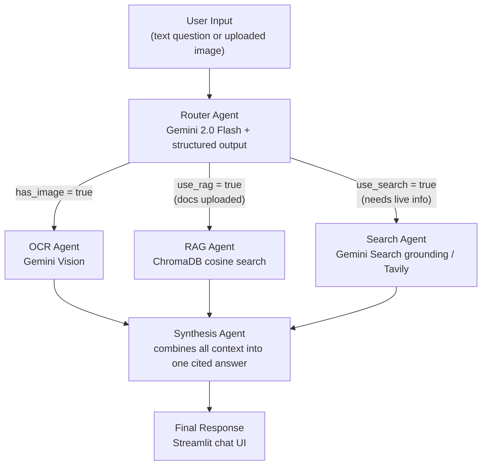

# StudyMate -- AI-Powered Study Assistant

Chat with your course materials using RAG, OCR, and live web search -- all from a single interface.

---

## Problem & Target User

Students preparing for exams juggle multiple tools: PDF readers for lecture notes, search engines for knowledge gaps, and OCR apps for photographed pages. Switching between them breaks focus and wastes time.

**StudyMate** is built for university students who want to query their own PDFs and lecture slides in natural language, extract text from photographed notes or whiteboards, and get answers that clearly distinguish *"from your notes"* from *"from the web"* -- all without manual source-switching. The multi-agent architecture automatically routes each question to the right source (or sources) and synthesizes a single, attributed answer.

---

## Features

- **PDF Upload + RAG** -- Upload course PDFs; they are chunked, embedded, and stored in a local ChromaDB vector store for semantic retrieval.
- **Image Upload + OCR** -- Upload photos of handwritten notes or whiteboards; Gemini Vision extracts the text and caches it for follow-up questions.
- **Web Search Grounding** -- Questions requiring current or external information are answered via Gemini's native Google Search grounding (with automatic Tavily fallback).
- **Multi-Agent Routing** -- An LLM-powered router decides which agents to invoke (OCR, RAG, Search) based on query content and session context.
- **Source Attribution** -- Every answer labels facts as "From your notes:", "From your uploaded image:", or "From the web:" so students can trust and cite them.
- **LangSmith Tracing** -- Full end-to-end observability: every pipeline run is traced with labelled child spans for each agent.

---

## Architecture Diagram



**How it works:** The user submits a question (and optionally uploads a file) through the Streamlit frontend. The Router Agent uses Gemini 2.0 Flash with structured output to decide which downstream agents to invoke. If an image was uploaded, the OCR Agent extracts text via Gemini Vision. If PDFs have been ingested, the RAG Agent retrieves the top-5 most relevant chunks from ChromaDB. If the query needs current or external information, the Search Agent queries the web via Gemini's native Google Search grounding (falling back to Tavily on error). Finally, the Synthesis Agent combines all available context into a single, source-attributed answer returned to the user.

---

## Tech Stack

| Layer | Technology | Purpose |
|-------|------------|---------|
| LLM / Vision | Gemini 2.0 Flash (`gemini-2.0-flash`) | Routing, OCR, search grounding, synthesis |
| Embeddings | Gemini Text Embedding (`gemini-embedding-001`) | PDF chunk embeddings for RAG |
| Orchestration | LangChain + LangGraph | Agent abstraction, structured output, message handling |
| Vector Store | ChromaDB (local, persisted) | Stores and retrieves embedded PDF chunks |
| Web Search | Gemini native Google Search grounding (Tavily fallback) | Live web information |
| Tracing | LangSmith | End-to-end pipeline observability |
| Backend | FastAPI | REST API (`/health`, `/upload`, `/ask`) |
| Frontend | Streamlit | Chat UI with file uploader and source panels |
| PDF Parsing | PyPDF (`pypdf`) | Extracts text from uploaded PDFs |

---

## Folder Structure

```
studymate/
+-- backend/
|   +-- main.py                # FastAPI app -- /health, /upload, /ask
|   +-- config.py              # Env var loading; imported first for LangSmith setup
|   +-- agents/
|   |   +-- router.py          # LLM-based routing (decides OCR/RAG/Search)
|   |   +-- ocr_agent.py       # Gemini Vision OCR
|   |   +-- rag_agent.py       # ChromaDB retrieval wrapper
|   |   +-- search_agent.py    # Gemini Search grounding / Tavily
|   |   +-- synthesis_agent.py # Combines context into final answer
|   +-- rag/
|   |   +-- ingest.py          # Chunks + embeds PDFs into ChromaDB
|   |   +-- retriever.py       # Query-time similarity search
|   +-- prompts/
|   |   +-- templates.py       # All prompt templates in one place
|   +-- models/
|       +-- schemas.py         # Pydantic request/response models
+-- frontend/
|   +-- app.py                 # Streamlit UI -- chat + file uploader
+-- data/
|   +-- chroma_db/             # Persisted vector store (gitignored)
+-- docs/
|   +-- screenshots/           # Screenshot placeholders
+-- requirements.txt
+-- .env.example               # Template for environment variables
+-- .gitignore
+-- README.md
```

---

## How It Works

### Router Agent (`backend/agents/router.py`)

The router receives the user's query plus two boolean flags: `has_image` (was an image just uploaded?) and `has_docs` (does this session have ingested PDFs?).

- **`use_ocr`** is set deterministically: `True` whenever `has_image=True`.
- **`use_rag`** and **`use_search`** are determined by Gemini 2.0 Flash via `with_structured_output`. The LLM is given a system prompt explaining the two sources (course docs vs. web) and returns a typed `_LLMDecision` object.
- **Fallback:** If the LLM call fails for any reason, a keyword-heuristic fallback activates (looks for terms like "latest", "2024", "news" to trigger search; defaults to RAG when docs exist).
- **Safety constraint:** At least one of `use_rag` or `use_search` is always `True`.

### RAG Pipeline (`backend/rag/ingest.py`, `backend/rag/retriever.py`)

| Parameter | Value |
|-----------|-------|
| Chunk size | 2500 characters (~625 tokens) |
| Chunk overlap | 400 characters (~100 tokens) |
| Splitter | `RecursiveCharacterTextSplitter` with separators `["\n\n", "\n", ". ", " ", ""]` |
| Embedding model | `gemini-embedding-001` (output dimensionality pinned to 768) |
| Top-k retrieval | 5 chunks |
| Similarity metric | Cosine (default in ChromaDB) |

PDFs are loaded with `PyPDFLoader`, split into overlapping chunks, embedded, and stored in a per-session ChromaDB collection named `studymate_<session_id>`. At query time, the same embedding model embeds the query and retrieves the top-5 most similar chunks.

> **Caution:** `ingest.py` and `retriever.py` must always use the exact same `model` string and `output_dimensionality`. If you ever change the embedding model, delete `CHROMA_DB_PATH` (default `./data/chroma_db`) first and re-ingest -- old collections are not compatible with a new model/dimensionality and will not raise an obvious error at query time. See ["Read Before You Use This"](#-read-before-you-use-this) at the top of this file.

### OCR Agent (`backend/agents/ocr_agent.py`)

- **Model:** Gemini 2.0 Flash (multimodal)
- **Input:** Base64-encoded image bytes embedded in a `HumanMessage` as a data-URL.
- **Prompt:** Instructs the model to extract all text while preserving structure (headings, lists, tables, paragraph breaks).
- **Output:** Raw extracted text, cached in memory so subsequent `/ask` calls can reference it.

### Search Agent (`backend/agents/search_agent.py`)

- **Default backend (`SEARCH_BACKEND=gemini`):** Uses the `google-genai` SDK to call Gemini 2.0 Flash with the native `google_search` grounding tool. Source URLs are extracted from `grounding_metadata`.
- **Tavily fallback:** If Gemini grounding fails and `TAVILY_API_KEY` is set, the agent automatically retries with Tavily's advanced search (5 results, `include_answer=True`).
- **Explicit Tavily mode (`SEARCH_BACKEND=tavily`):** Skips Gemini and calls Tavily directly.

### Synthesis Agent (`backend/agents/synthesis_agent.py`)

Receives any combination of OCR text, RAG chunks, and search results. Builds a labelled context block with section headers (`=== SOURCE: ... ===`) and prompts Gemini 2.0 Flash (temperature 0.2) to write a single answer with inline attribution ("From your notes:", "From the web:", etc.). Returns both the answer text and a flat list of `Source` objects for the UI.

---

## Setup Instructions

### Prerequisites

- Python 3.10+
- [Gemini API key](https://aistudio.google.com/app/apikey) (free tier is sufficient)
- [LangSmith API key](https://smith.langchain.com/) (free tier is sufficient)
- *(Optional)* [Tavily API key](https://app.tavily.com/) for the Tavily search fallback

### 1. Clone the repository

```bash
git clone <repo-url>
cd studymate
```

### 2. Create and activate a virtual environment

**macOS / Linux:**
```bash
python -m venv venv
source venv/bin/activate
```

**Windows (PowerShell):**
```powershell
python -m venv venv
venv\Scripts\Activate.ps1
```

**Windows (Command Prompt):**
```cmd
python -m venv venv
venv\Scripts\activate.bat
```

### 3. Install dependencies

```bash
pip install -r requirements.txt
```

### 4. Configure environment variables

```bash
cp .env.example .env
```

Open `.env` in a text editor and fill in your API keys. See the [Environment Variables](#environment-variables) table below for details.

### 5. Create the ChromaDB data folder (if needed)

The `data/chroma_db/` directory is created automatically on first PDF upload. If you want to pre-create it:

```bash
# macOS / Linux
mkdir -p data/chroma_db

# Windows (PowerShell)
New-Item -ItemType Directory -Force -Path data\chroma_db
```

---

## Environment Variables

These variables are read in `backend/config.py`. Copy `.env.example` to `.env` and fill in the required values.

| Variable | Required? | Default | Description |
|----------|-----------|---------|-------------|
| `GEMINI_API_KEY` | Yes | -- | Gemini API key for LLM, Vision (OCR), embeddings, and search grounding |
| `LANGCHAIN_API_KEY` | Yes | -- | LangSmith API key for tracing |
| `LANGCHAIN_TRACING_V2` | No | `true` | Set to `false` to disable LangSmith tracing |
| `LANGCHAIN_PROJECT` | No | `studymate` | LangSmith project name traces are filed under |
| `TAVILY_API_KEY` | No | -- | Tavily search API key; enables fallback when Gemini grounding fails |
| `SEARCH_BACKEND` | No | `gemini` | Search provider: `gemini` (default) or `tavily` |
| `CHROMA_DB_PATH` | No | `./data/chroma_db` | Directory where ChromaDB persists the vector store |

---

## Running the Project

Open **two terminal windows**, both inside the `studymate/` directory, with the virtual environment activated.

### Terminal 1 -- FastAPI backend

```bash
uvicorn backend.main:app --reload
```

- API available at: `http://localhost:8000`
- Interactive docs (Swagger): `http://localhost:8000/docs`

### Terminal 2 -- Streamlit frontend

```bash
streamlit run frontend/app.py
```

- UI opens automatically at: `http://localhost:8501`

> **Caution:** If you change any code in `backend/` or any value in `.env` while the backend is already running, confirm `uvicorn` actually picked it up. `--reload` should restart automatically on save, but if you have more than one terminal/process running `uvicorn backend.main:app`, or you're editing a different copy of the project than the one that's running, you will keep hitting the old behavior. When in doubt, stop the backend (Ctrl+C) and start it again.

---

## Usage Example

1. **Start both servers** (backend + frontend) as described above.
2. **Upload a PDF:** In the sidebar, click the file uploader and select a course PDF. Wait for the confirmation showing how many chunks were indexed.
3. **Ask a RAG question:** In the chat box, type a question about the PDF content (e.g., "What are the main topics covered in chapter 3?"). The answer will show "From your notes:" attribution and a collapsible **Sources** panel listing the retrieved chunks.
4. **Upload an image:** Click the file uploader again and select a photo of handwritten notes or a whiteboard. Wait for the OCR confirmation and optionally expand the text preview.
5. **Ask about the image:** Type a question referencing the image (e.g., "Summarize the key points from my uploaded image"). The answer will include "From your uploaded image:" attribution.
6. **Ask a live-search question:** Type a question requiring current information (e.g., "What were the latest developments in quantum computing this year?"). The router will invoke the Search Agent, and the answer will show "From the web:" attribution with clickable source links.

---

## LangSmith Tracing

Every `/ask` request is traced end-to-end in LangSmith as a parent run named **`studymate_pipeline`**, with each agent appearing as a labelled child step:

```
studymate_pipeline
+-- router_agent      -- routing decision (use_ocr / use_rag / use_search)
+-- rag_agent         -- ChromaDB retrieval (if invoked)
+-- search_agent      -- web search (if invoked)
+-- synthesis_agent   -- final answer generation
```

### To view a trace

1. Log in to [smith.langchain.com](https://smith.langchain.com/).
2. Select the **studymate** project (or the name you set in `LANGCHAIN_PROJECT`).
3. Click any run to see the full Router -> Agents -> Synthesis flow, including prompts, token counts, and latencies.

**Shortcut:** Every assistant response in the chat UI includes a **"View LangSmith trace"** link that opens the trace page directly (requires `LANGCHAIN_TRACING_V2=true`).

---

---

## Limitations / Future Improvements

- **Single-session only:** Session state is stored in-memory; restarting the backend clears OCR cache and uploaded-file tracking (ChromaDB persists, but the session-to-collection mapping is lost).
- **No authentication:** Designed for local, single-user use.
- **Limited file types:** Only PDFs and common image formats (JPG, PNG, WEBP, GIF, BMP, TIFF) are supported.
- **No streaming responses:** The full answer is returned after the pipeline completes; no token-by-token streaming.
- **No conversation memory:** Each question is answered independently; the agents do not retain multi-turn context beyond the current query.
- **Model name hardcoded:** `gemini-2.0-flash` is set in each agent file; switching models requires code changes.

---

## Academic Note

This project was built as a final project for a university course on AI applications.
