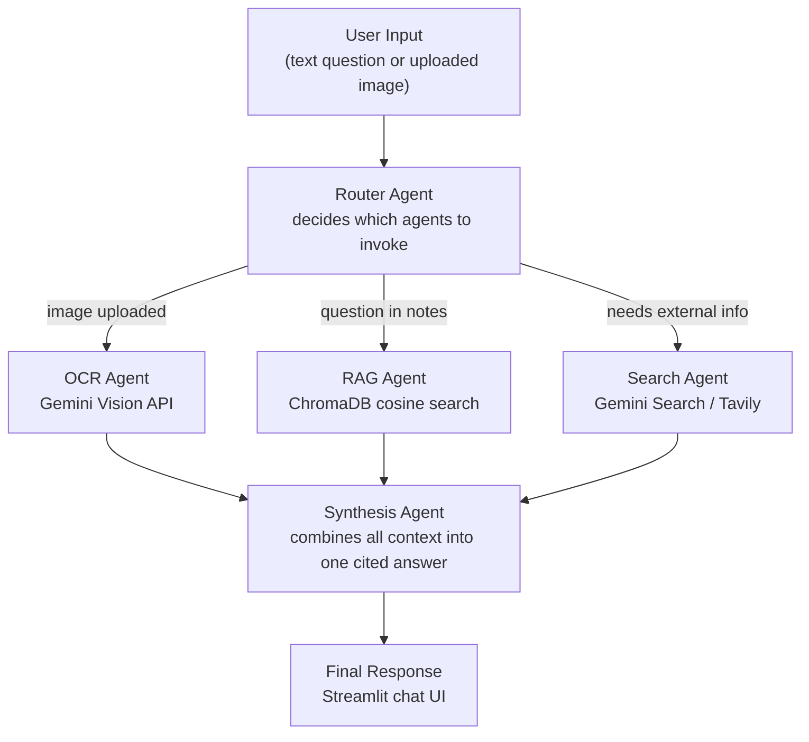

# StudyMate — AI Study Assistant

An AI-powered study assistant that lets students chat with their own course materials (PDFs, lecture slides, handwritten note photographs) and get answers grounded in both their notes and live web sources — all from a single chat interface.

---

## Problem Statement

Students revising for exams juggle multiple tools: a PDF reader for lecture notes, a search engine for gaps in understanding, and an OCR app for photographed textbook pages. Switching between them is slow and breaks focus.

**StudyMate solves this by routing every query to the right source automatically:**

- Question answered by your uploaded notes? &#8594; Retrieved from a local vector store (RAG).
- Photographed a whiteboard or handwritten page? &#8594; Text extracted via OCR, then answered.
- Question requires current or external information? &#8594; Searched on the web via Gemini grounding or Tavily.

The student types one question and gets one cited answer — no manual source-switching required.

## Target User

A university student who:
- Has course PDFs and/or lecture slides they want to query in natural language.
- Occasionally photographs handwritten notes or textbook pages and wants the text made searchable.
- Needs answers that clearly distinguish *"from your notes"* from *"from the web"* so they can trust and cite them.

---

## Architecture

```
User Input (text question OR uploaded image)
        &#9474;
        &#9660;
   Router Agent  &#9472;&#9472; decides which path(s) to use based on input type + query content
        &#9474;
        &#9500;&#9472;&#9472;> OCR Agent      (only if an image was uploaded)
        &#9474;        Gemini Vision API extracts text from the image
        &#9474;
        &#9500;&#9472;&#9472;> RAG Agent      (if question likely answered by uploaded course docs)
        &#9474;        Retrieves top-k chunks from ChromaDB vector store
        &#9474;
        &#9500;&#9472;&#9472;> Search Agent   (if question needs current/external info not in notes)
        &#9474;        Gemini API Google Search grounding (or Tavily API fallback)
        &#9474;
        &#9660;
   Synthesis Agent  &#9472;&#9472; combines OCR text + retrieved chunks + search results
        &#9474;              into one coherent, cited answer
        &#9660;
   Final Response to user (shown in Streamlit chat UI)
```



### Tech Stack

| Layer | Choice |
|---|---|
| LLM / Vision / Embeddings | Gemini API (`gemini-2.0-flash`, `text-embedding-004`) |
| Orchestration | LangChain + LangGraph |
| Vector store | ChromaDB (local, embedded) |
| Web search | Gemini native Google Search grounding (Tavily as fallback) |
| Tracing | LangSmith |
| Backend | FastAPI |
| Frontend | Streamlit |

---

## Project Structure

```
studymate/
&#9500;&#9472;&#9472; backend/
&#9474;   &#9500;&#9472;&#9472; main.py                # FastAPI app — /health, /upload, /ask
&#9474;   &#9500;&#9472;&#9472; config.py              # Env var loading; must be imported first
&#9474;   &#9500;&#9472;&#9472; agents/
&#9474;   &#9474;   &#9500;&#9472;&#9472; router.py          # Decides which agents to invoke
&#9474;   &#9474;   &#9500;&#9472;&#9472; ocr_agent.py       # Gemini Vision OCR
&#9474;   &#9474;   &#9500;&#9472;&#9472; rag_agent.py       # ChromaDB retrieval
&#9474;   &#9474;   &#9500;&#9472;&#9472; search_agent.py    # Web search grounding
&#9474;   &#9474;   &#9492;&#9472;&#9472; synthesis_agent.py # Combines context into final answer
&#9474;   &#9500;&#9472;&#9472; rag/
&#9474;   &#9474;   &#9500;&#9472;&#9472; ingest.py          # Chunks + embeds PDFs into ChromaDB
&#9474;   &#9474;   &#9492;&#9472;&#9472; retriever.py       # Query-time similarity search
&#9474;   &#9500;&#9472;&#9472; prompts/
&#9474;   &#9474;   &#9492;&#9472;&#9472; templates.py       # All prompt templates
&#9474;   &#9492;&#9472;&#9472; models/
&#9474;       &#9492;&#9472;&#9472; schemas.py         # Pydantic request/response models
&#9500;&#9472;&#9472; frontend/
&#9474;   &#9492;&#9472;&#9472; app.py                 # Streamlit UI — chat + file uploader
&#9500;&#9472;&#9472; data/
&#9474;   &#9492;&#9472;&#9472; chroma_db/             # Persisted vector store (gitignored)
&#9500;&#9472;&#9472; requirements.txt
&#9500;&#9472;&#9472; .env.example               # Copy to .env and fill in your keys
&#9500;&#9472;&#9472; .gitignore
&#9492;&#9472;&#9472; README.md
```

---

## Setup

### Prerequisites

- Python 3.10 or later
- A [Gemini API key](https://aistudio.google.com/app/apikey) (free tier is sufficient)
- A [LangSmith API key](https://smith.langchain.com/) (free tier is sufficient)
- *(Optional)* A [Tavily API key](https://app.tavily.com/) if you prefer Tavily over Gemini's built-in search grounding

### 1 — Clone the repository

```bash
git clone <repo-url>
cd studymate
```

### 2 — Create and activate a virtual environment

```bash
# macOS / Linux
python -m venv venv
source venv/bin/activate

# Windows (PowerShell)
python -m venv venv
venv\Scripts\Activate.ps1
```

### 3 — Install dependencies

```bash
pip install -r requirements.txt
```

### 4 — Configure environment variables

```bash
cp .env.example .env
```

Open `.env` and fill in your API keys (see the [Environment Variables](#environment-variables) table below). The file is gitignored so your keys will not be committed.

---

## Running the App

Both processes must be running simultaneously — open two terminal windows, both inside the `studymate/` directory.

### Terminal 1 — FastAPI backend

```bash
uvicorn backend.main:app --reload
```

The API will be available at `http://localhost:8000`.  
Interactive docs: `http://localhost:8000/docs`.

### Terminal 2 — Streamlit frontend

```bash
streamlit run frontend/app.py
```

The UI will open automatically at `http://localhost:8501`.

### Quick-start workflow

1. Upload a PDF or image using the sidebar uploader.
2. Wait for the confirmation message (*"N chunk(s) indexed"* for PDFs, *"OCR complete"* for images).
3. Type a question in the chat box and press Enter.
4. The answer appears with an expandable **Sources** panel showing which notes or web pages were used.

---

## Environment Variables

Copy `.env.example` to `.env` and set the following:

| Variable | Required | Default | Description |
|---|---|---|---|
| `GEMINI_API_KEY` | &#9989; Yes | — | Gemini API key for LLM, Vision (OCR), embeddings, and search grounding |
| `LANGCHAIN_API_KEY` | &#9989; Yes | — | LangSmith API key for tracing |
| `LANGCHAIN_TRACING_V2` | No | `true` | Set to `false` to disable LangSmith tracing |
| `LANGCHAIN_PROJECT` | No | `studymate` | LangSmith project name traces are filed under |
| `TAVILY_API_KEY` | No | — | Tavily search API key; required only when `SEARCH_BACKEND=tavily` |
| `SEARCH_BACKEND` | No | `gemini` | Search provider: `gemini` (default) or `tavily` |
| `CHROMA_DB_PATH` | No | `./data/chroma_db` | Directory where ChromaDB persists the vector store |

---

## Viewing LangSmith Traces

Every `/ask` request is traced end-to-end in LangSmith as a single parent run called **`studymate_pipeline`**, with each agent appearing as a labelled child step:

```
studymate_pipeline
&#9500;&#9472;&#9472; router          — routing decision (use_ocr / use_rag / use_search)
&#9500;&#9472;&#9472; rag_agent       — ChromaDB retrieval (if invoked)
&#9500;&#9472;&#9472; search_agent    — web search (if invoked)
&#9492;&#9472;&#9472; synthesis_agent — final answer generation
```

### To open a trace

1. Log in to [smith.langchain.com](https://smith.langchain.com/).
2. Select the **studymate** project (or whatever you set `LANGCHAIN_PROJECT` to).
3. Click any run to see the full Router &#8594; Agents &#8594; Synthesis flow, the prompt sent to each agent, token counts, and latencies.

Alternatively, every assistant response in the chat UI includes a **"&#128269; View LangSmith trace"** link that takes you directly to that run's trace page (requires `LANGCHAIN_TRACING_V2=true`).

---

## Screenshots

> **To add screenshots:** run the app, capture the images listed in [`docs/screenshots/README.md`](docs/screenshots/README.md), save them to that directory, and replace the placeholders below.

| Screenshot | Description |
|---|---|
| `docs/screenshots/chat_pdf.png` | Chat after uploading a PDF — sources panel expanded showing "From your notes:" |
| `docs/screenshots/sources_panel.png` | Sources panel with both notes (&#128196;) and web (&#127760;) results in one response |
| `docs/screenshots/ocr_result.png` | Sidebar OCR preview + chat answer attributing "From your uploaded image:" |
| `docs/screenshots/langsmith_trace.png` | LangSmith trace showing `router_agent` &#8594; `rag_agent` &#8594; `synthesis_agent` child steps |

<!--
Once captured, uncomment these lines:


-->

---

## Out of Scope

- User authentication / multi-user accounts (single-session only).
- Production deployment (local run is the target environment).
- File types beyond PDF and common image formats (JPG, PNG, WEBP, GIF, BMP, TIFF).
- Model fine-tuning — this project is API orchestration only.
